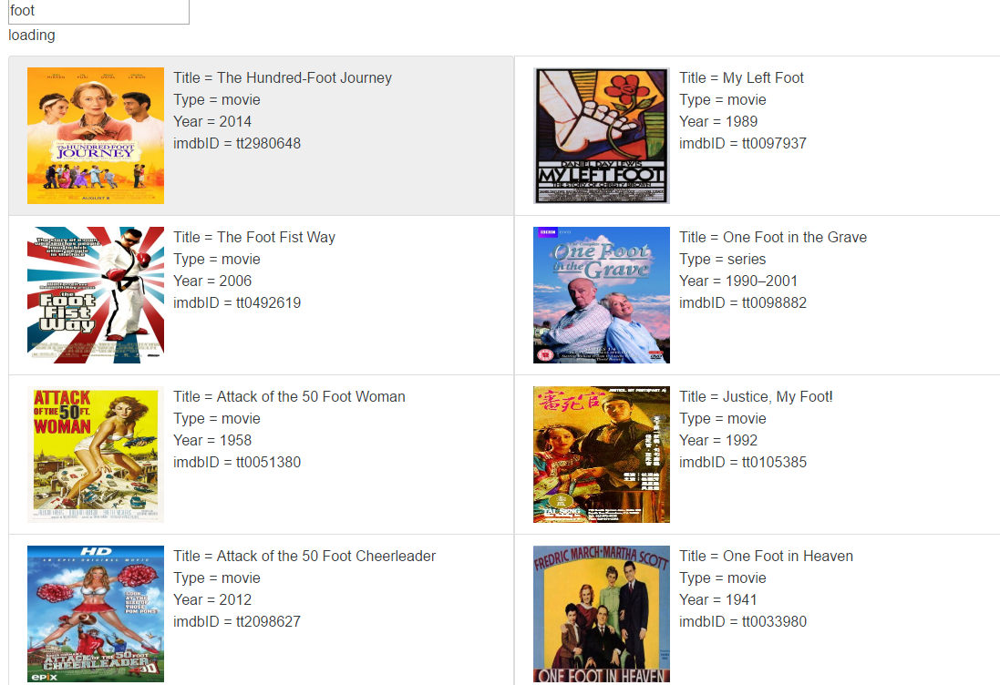

# movie_finder
A simple movie finder using React. Using the OMDb API http://www.omdbapi.com/

# Installation: 
  - Start in app directory
  - npm install
  - npm start
  - localhost:8080 (default)

# Presentation:

